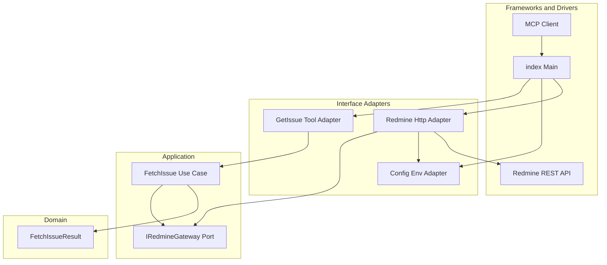
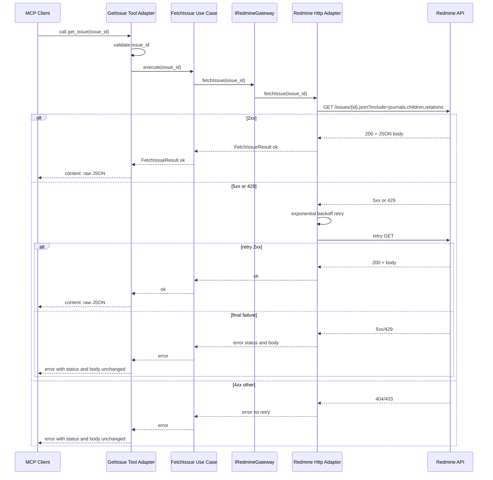

# Technical Design: Redmine イシュー取得

---
**Purpose**: 実装の一貫性を保つための十分な詳細を提供し、解釈のぶれを防ぐ。

**Approach**:
- 実装判断に直結する必須セクションを含める
- 実装誤りを防ぐために不可欠な場合以外は任意セクションを省略
- 機能の複雑さに合わせて詳細レベルを調整
- 長文より図・表を優先する
---

## Overview

本機能は、Redmine MCP Server がエージェント（MCP クライアント）向けに「イシュー ID を指定して 1 件の Redmine イシューを取得し、journals・children・relations を含む Redmine の JSON を改変せずに返す」能力を提供する。エージェントは返却された文脈を利用して回答や判断を行う。

**Users**: MCP クライアント（Claude Desktop、MCP Inspector 等）を利用するユーザーおよび AI エージェント。利用者はイシュー ID を指定してツールを呼び出し、成功時はイシュー詳細 JSON、失敗時は Redmine の HTTP ステータスと JSON をそのまま受け取る。

**Impact**: 現在のシステムには未実装のため、新規に MCP ツール 1 本、Redmine 用 HTTP クライアント、および起動時設定検証を追加する。既存コードベースは存在しない。

### Goals

- イシュー ID 指定で Redmine から 1 件取得し、`include=journals,children,relations` を固定で付与する（1.1–1.4）。
- 成功時は Redmine の JSON を改変せずにエージェントに渡す（2.1–2.2）。
- エラー時は Redmine の HTTP ステータスと JSON をそのまま渡す（3.1–3.4）。
- `X-Redmine-API-Key` による認証を使用する（4.1–4.2）。
- HTTP 5xx および 429 に対してのみ指数バックオフでリトライする（5.1–5.3）。

### Non-Goals

- include の動的指定（将来要件になった場合に検討）。
- イシュー一覧・検索（別機能）。
- リトライ回数・遅延の環境変数化（初期は固定値；必要なら後続で拡張）。
- ペイロードサイズ制限・ページネーション（巨大 journals は現状スコープ外）。

## Architecture

### Existing Architecture Analysis

- TypeScript ソースは未存在。クリーンアーキテクチャを採用し、Domain → Application（Use Case + Ports）→ Adapters → Main の依存方向で新規に導入する。
- 依存の向き: 外側は内側に依存する。フレームワーク（index）がアダプタを組み立て、アダプタがユースケースを呼び、ユースケースがポート（IRedmineGateway）に依存する。Redmine の HTTP やリトライはアダプタに閉じる。

### File Tree

本機能で追加・参照するファイル構成。ルートはリポジトリ直下。クリーンアーキテクチャのレイヤごとにディレクトリを分ける。

```
redmine-mcp/
├── src/
│   ├── index.ts                    # Main: MCP サーバー起動、DI、ツール登録
│   ├── domain/
│   │   └── fetch-issue-result.ts   # Entity: FetchIssueResult 型（成功/失敗の判別付き共用体）
│   ├── application/
│   │   ├── ports.ts                # Port: IRedmineGateway インターフェース
│   │   └── fetch-issue-use-case.ts # Use Case: イシュー取得のアプリケーションルール（Gateway 呼び出し）
│   └── adapters/
│   │   ├── redmine-http.adapter.ts # IRedmineGateway 実装: HTTP、リトライ、認証ヘッダー
│   │   ├── config-env.adapter.ts   # 起動時: REDMINE_URL, REDMINE_API_KEY の読込・Zod 検証
│   │   └── get-issue-tool.adapter.ts # MCP ツール: 入力検証、Use Case 呼び出し、結果を MCP レスポンスに変換
├── dist/                           # ビルド出力 (bun build → dist/index.js)
├── docs/
│   ├── steering/
│   └── specs/
│       └── v1.0/
│           └── redmine-issue-fetch/
├── package.json
└── tsconfig.json
```

- **domain/**: フレームワーク・外部 I/O に依存しない型のみ。本機能では「取得結果」を表す `FetchIssueResult` を定義する。
- **application/**: ユースケースとポート（インターフェース）。ユースケースはポートにのみ依存し、HTTP や MCP の詳細は知らない。
- **adapters/**: ポートの実装とフレームワークとの接続。Redmine HTTP（+ リトライ）、env 設定読込、MCP ツールの登録・ハンドラ。
- **index.ts**: 設定読込、アダプタ・ユースケースの組み立て、MCP サーバー起動とツール登録。steering の単一エントリ方針を維持。

### Architecture Pattern & Boundary Map

**Architecture Integration**:
- **Selected pattern**: クリーンアーキテクチャ（Clean Architecture）。依存は内側向き。Entity → Use Case → Interface Adapters（Port 実装）→ Frameworks & Drivers（Main）。
- **Domain boundaries**: Domain は取得結果の型のみ。Application は「イシューを取得する」ユースケースと「Redmine から取得する」ポート。Adapters が HTTP・リトライ・認証・MCP プロトコルを担当。
- **Existing patterns preserved**: 単一エントリ、相対 import、Zod による設定検証。ビルドは `rootDir: ./src`, `outDir: ./dist` のまま。
- **New components rationale**: テスト時に Gateway をモック可能にし、ユースケースの単体テストと Redmine 依存のアダプタテストを分離する。将来の他ツールでも同一ポート・ユースケースを再利用できる。



- **依存の向き**: Main → Adapters → Application → Domain。Port は Application に定義され、Adapters が実装する。

### Technology Stack

| Layer | Choice / Version | Role in Feature | Notes |
|-------|------------------|-----------------|-------|
| Backend / Services | TypeScript (strict), Bun | MCP サーバー・ツール・Redmine 呼び出し | steering 準拠 |
| Protocol | MCP SDK | ツール登録・引数・戻り値 | 既存方針 |
| Validation | Zod | ツール入力・起動時設定 | 既存方針 |
| HTTP | Bun 組み込み fetch または安定した HTTP クライアント | Redmine REST API 呼び出し・リトライ | 新規利用 |
| Infrastructure / Runtime | Bun, env vars | REDMINE_URL, REDMINE_API_KEY | 既存方針 |

## System Flows

### イシュー取得フロー（成功・リトライ・最終失敗）



- **Flow-level decisions**: リトライは Redmine Http Adapter 内で完結。Use Case は Gateway を 1 回呼ぶだけ。Tool Adapter は Use Case の戻り値（FetchIssueResult）を MCP レスポンスにそのままマッピングする。4xx はリトライしない。

## Requirements Traceability

| Requirement | Summary | Components | Interfaces | Flows |
|-------------|---------|------------|------------|-------|
| 1.1 | 有効 ID で Redmine API によりイシュー取得 | FetchIssueUseCase, RedmineHttpAdapter | IRedmineGateway.fetchIssue | 上記シーケンス |
| 1.2 | include を journals,children,relations に固定 | RedmineHttpAdapter | 内部 URL 構築 | 同上 |
| 1.3, 1.4 | 存在する/しない場合の返却 | FetchIssueResult, RedmineHttpAdapter, GetIssueToolAdapter | 戻り型 | 同上 |
| 2.1, 2.2 | 成功時ペイロード改変なし | RedmineHttpAdapter, GetIssueToolAdapter | FetchIssueResult そのまま | 同上 |
| 3.1–3.4 | 未存在・権限不足・エラーそのまま | RedmineHttpAdapter, GetIssueToolAdapter | FetchIssueResult error | 同上 |
| 4.1, 4.2 | X-Redmine-API-Key 認証 | RedmineHttpAdapter, ConfigEnvAdapter | ヘッダー付与、env 読込 | 同上 |
| 5.1–5.3 | 5xx/429 のみ指数バックオフリトライ | RedmineHttpAdapter | fetchIssue 内リトライ | 同上 |

## Components and Interfaces

| Component | Layer | Intent | Req Coverage | Key Dependencies | Contracts |
|-----------|-------|--------|--------------|------------------|-----------|
| FetchIssueResult | Domain | 取得結果の型（成功/失敗の判別付き共用体） | 1.3–3.4 | なし | State |
| IRedmineGateway | Application (Port) | イシュー取得の抽象（実装は Adapter） | 1.x, 2.x, 5.x | なし | Service |
| FetchIssueUseCase | Application | イシュー取得のアプリケーションルール（Gateway 呼び出し） | 1.1, 2.x | IRedmineGateway (P0) | Service |
| RedmineHttpAdapter | Adapters | IRedmineGateway 実装: HTTP、リトライ、認証 | 1.x, 2.x, 3.3, 4.x, 5.x | ConfigEnvAdapter (P0), Redmine API (P0) | Service |
| ConfigEnvAdapter | Adapters | 起動時設定の読込・Zod 検証 | 4.1 | env (P0) | State |
| GetIssueToolAdapter | Adapters | MCP ツール登録・入力検証・Use Case 呼び出し・MCP レスポンス変換 | 1.1, 2.x, 3.x | FetchIssueUseCase (P0) | Service |

### Domain

#### FetchIssueResult

| Field | Detail |
|-------|--------|
| Intent | イシュー取得の結果を表す型。成功時は body（Redmine JSON）のみ、失敗時は status と body をそのまま持つ。フレームワーク・I/O に依存しない。 |
| Requirements | 1.3, 1.4, 2.1, 2.2, 3.1–3.4 |

**Responsibilities & Constraints**
- 判別可能な共用体（discriminated union）。`ok: true` のとき `body: unknown`、`ok: false` のとき `status: number`, `body: unknown`。body は改変せず受け渡すのみ。
- Domain 層は他レイヤに依存しない。ファイルは `domain/fetch-issue-result.ts` のみで、import は型・ユーティリティに限定する。

**Contracts**: State [x]

##### 型定義

```typescript
export type FetchIssueResult =
  | { ok: true; body: unknown }
  | { ok: false; status: number; body: unknown };
```

### Application

#### IRedmineGateway (Port)

| Field | Detail |
|-------|--------|
| Intent | イシューを 1 件取得する抽象。実装は Adapters が担当する（HTTP・リトライ・認証の詳細は Application から見えない）。 |
| Requirements | 1.1, 1.2, 2.1, 2.2, 3.3, 4.1, 5.1–5.3 |

**Responsibilities & Constraints**
- Application 層に定義され、Adapters が実装する。Use Case はこのインターフェースにのみ依存する。
- 戻り型は Domain の `FetchIssueResult`。成功時は Redmine の body をそのまま、失敗時は status と body をそのまま返す。

**Dependencies**
- Inbound: なし（Port は Application が定義）
- Outbound: なし（型として FetchIssueResult を参照するのみ）

**Contracts**: Service [x]

##### Service Interface

```typescript
import type { FetchIssueResult } from "../domain/fetch-issue-result.js";

export interface IRedmineGateway {
  fetchIssue(issueId: number): Promise<FetchIssueResult>;
}
```

- Preconditions: `issueId` は正整数（呼び出し元で検証済みであることを前提にしてもよい）。
- Postconditions: 成功時は `body` を Redmine のレスポンスそのまま。失敗時は `status` と `body` を Redmine のレスポンスそのまま。
- Invariants: 戻り値の `body` に手を加えない。

#### FetchIssueUseCase

| Field | Detail |
|-------|--------|
| Intent | 「イシュー ID を指定して取得する」アプリケーションルール。Gateway（Port）を呼び、その結果をそのまま返す。 |
| Requirements | 1.1, 2.1, 2.2, 3.3 |

**Responsibilities & Constraints**
- Gateway にのみ依存。HTTP・リトライ・MCP の詳細は知らない。現状は Gateway の戻り値をそのまま返すだけであり、将来ここにアプリケーション固有のルール（例: プロジェクト別の追加取得）を足せる。
- 入力は `issueId: number`、出力は `Promise<FetchIssueResult>`。

**Dependencies**
- Inbound: なし（Main が注入）
- Outbound: IRedmineGateway — fetchIssue (P0)

**Contracts**: Service [x]

##### Service Interface

```typescript
import type { FetchIssueResult } from "../domain/fetch-issue-result.js";
import type { IRedmineGateway } from "./ports.js";

export class FetchIssueUseCase {
  constructor(private readonly gateway: IRedmineGateway) {}
  async execute(issueId: number): Promise<FetchIssueResult> {
    return this.gateway.fetchIssue(issueId);
  }
}
```

- Preconditions: `gateway` は有効な IRedmineGateway の実装。`issueId` は正整数。
- Postconditions: Gateway の戻り値を改変せずそのまま返す。
- Invariants: ビジネスルールの追加はこの層に閉じる。

### Adapters

#### RedmineHttpAdapter

| Field | Detail |
|-------|--------|
| Intent | IRedmineGateway の実装。Redmine REST API に GET でイシュー 1 件を取得し、5xx/429 のみ指数バックオフでリトライする。認証は `X-Redmine-API-Key`。 |
| Requirements | 1.1, 1.2, 1.3, 1.4, 2.1, 2.2, 3.3, 4.1, 5.1, 5.2, 5.3 |

**Responsibilities & Constraints**
- URL は `GET {baseUrl}/issues/{id}.json?include=journals,children,relations`。レスポンスは改変しない。
- リトライ: 5xx および 429 のみ。最大回数・初回遅延・倍率は固定値（例: 最大 3 回、1s → 2s → 4s）。4xx はリトライしない。
- コンストラクタで設定（baseUrl, apiKey）を受け取り、env の読込は行わない（ConfigEnvAdapter が担当）。

**Dependencies**
- Inbound: Main — コンストラクタで設定を注入 (P0)
- Outbound: なし（Application の Port を実装）
- External: Redmine REST API — GET /issues/{id}.json (P0)

**Contracts**: Service [x]（IRedmineGateway を実装）

##### Implementation Notes
- ConfigEnvAdapter から取得した `{ baseUrl, apiKey }` をコンストラクタで受け取る。各リクエストに `X-Redmine-API-Key` を付与。`issueId` の検証は呼び出し元（GetIssueToolAdapter）で行い、本 Adapter は number のみ受け付ける。Redmine の `children` 挙動は E2E で実機確認する。

#### ConfigEnvAdapter

| Field | Detail |
|-------|--------|
| Intent | 起動時に `REDMINE_URL` と `REDMINE_API_KEY` を読み、Zod で検証する。検証済み値を返す。 |
| Requirements | 4.1 |

**Responsibilities & Constraints**
- 読み取り専用。env 以外に設定ファイルは使わない（steering 方針）。検証失敗時は起動を中止し、明確なメッセージを出す。

**Dependencies**
- Inbound: なし（process.env または Bun.env から読む）
- Outbound: なし（Main が呼び出し、RedmineHttpAdapter に渡す）

**Contracts**: State（読み取り専用）。公開型: 例 `{ baseUrl: string; apiKey: string }`。

#### GetIssueToolAdapter

| Field | Detail |
|-------|--------|
| Intent | MCP の「イシュー取得」ツールを登録し、引数で issue_id を受け取る。入力検証後、FetchIssueUseCase を呼び、結果（FetchIssueResult）を MCP ツールレスポンスにそのままマッピングする。 |
| Requirements | 1.1, 2.1, 2.2, 3.1, 3.2, 3.3, 3.4 |

**Responsibilities & Constraints**
- ツール名・スキーマは MCP のツール定義に従う（例: `redmine_get_issue`、入力 `issue_id`）。入力検証: `issue_id` を正整数にパース。不正なら MCP のバリデーションエラーを返し、Use Case は呼ばない。
- 成功時: FetchIssueResult の `body` を MCP の content としてそのまま渡す。失敗時: `status` と `body` をエージェントに分かる形で含める（改変なし）。

**Dependencies**
- Inbound: MCP Server（SDK）— ツール登録・呼び出し (P0)
- Outbound: FetchIssueUseCase — execute (P0)
- External: なし

**Contracts**: Service [x]（MCP SDK のツールコールバックとして登録）

##### Implementation Notes
- Main で FetchIssueUseCase を注入する。Use Case の戻り値が ok/error で分岐し、MCP の content または error にそのまま載せる。ペイロードの変換・省略・付加をしない。

## Data Models

- 本機能では永続化は行わない。
- **Domain**: 取得結果のみを型で表現する。`FetchIssueResult`（成功時 `{ ok: true, body: unknown }` / 失敗時 `{ ok: false, status: number, body: unknown }`）を Domain に置き、Application および Adapters がこれを共有する。Redmine のイシュー構造は API 仕様に委ね、body は `unknown` のまま改変せず受け渡すのみとする。

### Data Contracts & Integration

**API Data Transfer**
- **Redmine → システム**: `GET /issues/{id}.json?include=journals,children,relations` のレスポンス body をそのまま使用。スキーマは Redmine に委ねる。
- **システム → MCP Client（成功）**: ツールの content に上記 body をそのまま載せる（JSON 文字列または MCP が許す形で）。
- **システム → MCP Client（失敗）**: HTTP ステータスと body を改変せず含める。MCP のエラー表現（例: content に `{ statusCode, body }` を入れる）は実装で定義する。
- **Validation**: ツール入力は `issue_id` を正整数に限定。Redmine の body は検証しない（そのまま渡すため）。

## Error Handling

### Error Strategy
- **入力エラー（不正な issue_id）**: ツール層で検証し、Redmine を呼ばずに MCP としてバリデーションエラーを返す。
- **Redmine 4xx（404, 403 等）**: リトライせず、status と body をそのままエージェントに渡す（3.1–3.4 対応）。
- **Redmine 5xx / 429**: 指数バックオフでリトライ。最終失敗時はその時点の status と body をそのまま渡す。
- **ネットワーク障害・タイムアウト**: ネットワーク障害・タイムアウト・その他の fetch 失敗は、RedmineHttpAdapter 内で必ず catch し、FetchIssueResult の ok: false 形（例: status 0 または 502、body に原因が分かる最小限の情報）で返す。Use Case / Tool 層には例外を伝播させない。

### Error Categories and Responses
- **User/Client Errors**: 不正な issue_id → ツール層でバリデーションエラー。
- **Redmine 4xx**: 未存在・権限不足など → status と JSON をそのまま返す。
- **Redmine 5xx/429**: リトライ後、最終結果をそのまま返す。

### Monitoring
- ログ: リクエスト開始・成功/失敗・リトライ回数程度。API キーや body の内容はログに含めない（steering のログ方針に合わせる）。

## Testing Strategy

- **Unit (Domain)**: FetchIssueResult の型と判別方法（ok フラグ）の利用が正しいことを型レベルで検証。
- **Unit (Application)**: FetchIssueUseCase を IRedmineGateway のモックでテスト。Gateway が返した FetchIssueResult がそのまま返ることを検証。
- **Unit (Adapters)**: RedmineHttpAdapter の「リトライ条件（5xx/429 のみ）」「リトライしない（4xx）」「成功時 body そのまま返す」をモック HTTP で検証。GetIssueToolAdapter の入力検証（不正 issue_id で Use Case を呼ばない）を検証。
- **Integration**: Main の組み立て（ConfigEnv → RedmineHttpAdapter → Use Case → GetIssueToolAdapter）のうえで、モックサーバーに 200/404/403/500/429 を返させ、ツール出力が「そのまま」であることを確認。
- **E2E**: MCP Inspector と実 Redmine を用い、有効 ID で journals/children/relations が含まれること、存在しない ID で 404、権限なしで 403 相当がそのまま返ることを確認。

## Security Considerations
- **認証**: API キーは環境変数のみ。`X-Redmine-API-Key` で送信。ログ・エラーメッセージに API キーを含めない。
- **データ**: イシュー本文は Redmine の権限に依存し、当システムでは追加のアクセス制御を行わない（Redmine の応答をそのまま渡すのみ）。

## Supporting References
- Redmine REST API: [Rest Issues](https://www.redmine.org/projects/redmine/wiki/rest_issues)
- 調査・境界の根拠: `docs/specs/v1.0/redmine-issue-fetch/research.md`
